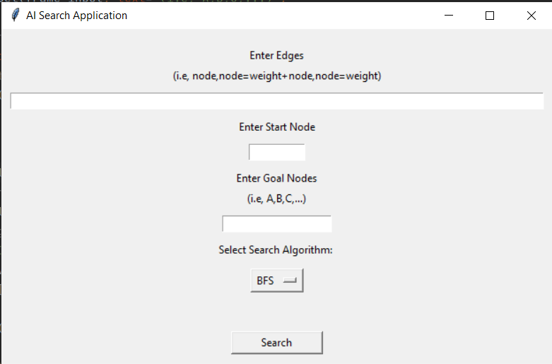

# AI Search Application
## Video Demo:  <URL HERE>
## Description:
This application implements various search algorithms to find the optimal path between a start node and a goal node in a graph. The search algorithms implemented in this application include:
* Breadth-First Search (BFS)
* Depth-First Search (DFS)
* Uniform-Cost Search (UCS)
* Greedy Best-Frist Search
* A* Best-First Search

## Installation and How to Run
To use this project, you must have Python 3 installed on your system. If you do not have Python 3 installed, you can download it from the official website: https://www.python.org/downloads/

After installing Python 3, you can install the necessary dependencies using pip. To install the required packages, run the following command in your terminal or command prompt:

```
pip install -r requirements.txt
```
This command will install all the dependencies listed in the requirements.txt file.

Once you have installed the dependencies, you can run the project by write the following command in your terminal or command prompt:
```
python main.py
```
This command will run the program

## Input
<br>

<br>
1. Enter edges in the following format: Node1, Node2=Cost + Node2, Node3=Cost in the “Enter Edges” field <br>
2. Enter a start node to begin the search from it in the “Enter Start Node” field.<br>
3. Enter the goal nodes in the “Enter Goal Nodes” field to be reached applying the search algorithm selected<br>
4. Select the search algorithm from the option menu (BFS, DFS, UCS, Greedy, A*)<br>
5. Click Search button to run the selected search algorithm on the provided graph<br>

## Output
<br>

<br>

## Test Cases
