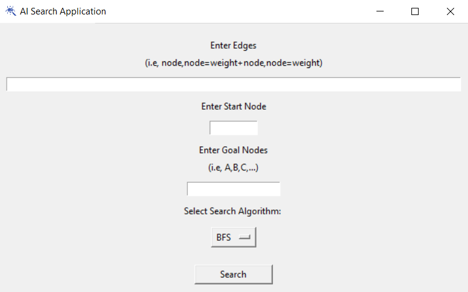

# AI Search Application

## Video Demo:
[AI Search Application Demo](URL_HERE)

## Description:
This application implements various search algorithms to find the optimal path between a start node and a goal node in a graph. The search algorithms implemented in this application include:
* Breadth-First Search (BFS)
* Depth-First Search (DFS)
* Uniform-Cost Search (UCS)
* Greedy Best-Frist Search
* A* Best-First Search

## Installation and How to Run
### Prerequisites
- Python 3 is required. If you don't have it, you can download it from the [official Python website](https://www.python.org/downloads/).
### Setup
1. Clone this project:
```
git clone https://github.com/reda-mohsen/AI_Search_App
cd AI-Search-Application
```
2. Install the necessary dependencies using pip:
```
pip install -r requirements.txt
```
### Running the Application
- Run the application by executing:
```
python main.py
```

## Input
<br>  <br>
To use the application: <br>
1. Enter edges in the following format: `Node1, Node2=Cost + Node2, Node3=Cost` in the "Enter Edges" field. <br>
2. Enter a start node to begin the search from it in the "Enter Start Node" field. <br>
3. Enter the goal nodes in the "Enter Goal Nodes" field to be reached using the selected search algorithm. <br>
4. Select the search algorithm from the option menu (BFS, DFS, UCS, Greedy, A*). <br>
5. Click the "Search" button to run the selected search algorithm on the provided graph. <br>

## Output
<br>  <br>

## Test Cases
